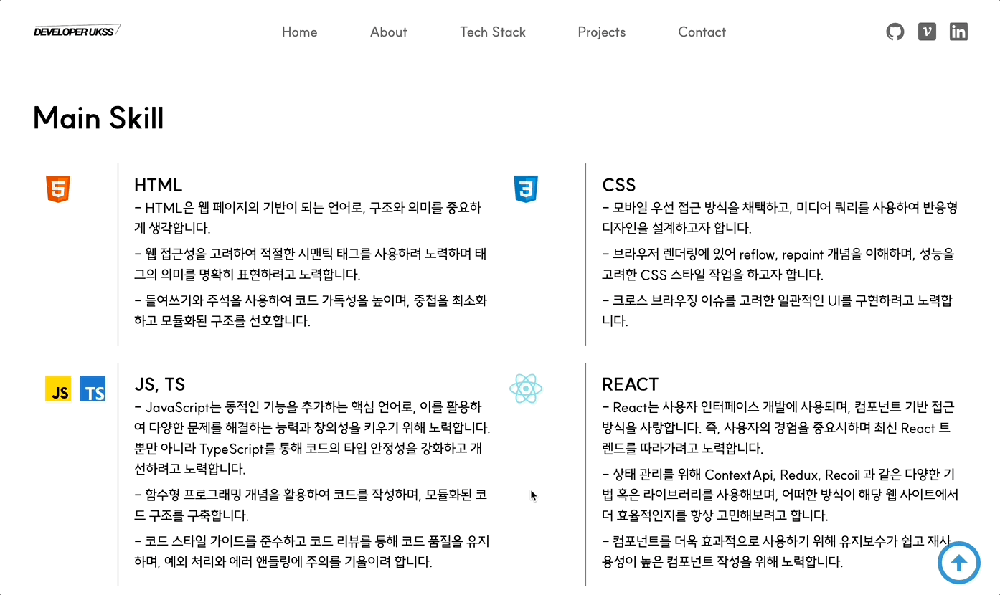

# Portfolio

<p>
    
</p>

-   목표 : 포트폴리오를 구성하기 위해 개발한 프로젝트입니다. 해당 프로젝트는 나의
    웹 개발 스킬, 이력, 자격 사항을 강조하기 위해 제작하였습니다.
-   배포 URL : [배포 URL 바로가기](https://portfolio-ukssss.vercel.app/)

## 기술 스택

      

## 설치 및 실행

1. 저장소 복제 (Clone Repository)

```zsh
$ git clone https://github.com/ukssss/portfolio.git
```

2. 종속성 설치 (Install Dependencies)

```zsh
$ npm install
```

3. 애플리케이션 실행 (Run Application)

```zsh
$ npm run dev
```

## 폴더 구조

```base
src
 ┣ assets
 ┃ ┗ react.svg
 ┣ components
 ┃ ┣ common
 ┃ ┃ ┣ Error.tsx
 ┃ ┃ ┣ Footer.tsx
 ┃ ┃ ┣ Hamburger.tsx
 ┃ ┃ ┣ Header.tsx
 ┃ ┃ ┣ ScrollToTop.tsx
 ┃ ┃ ┣ SideCar.tsx
 ┃ ┃ ┗ SubTitle.tsx
 ┃ ┣ domain
 ┃ ┗ index.ts
 ┣ fonts
 ┃ ┣ SUITE-Bold.woff2
 ┃ ┣ SUITE-ExtraBold.woff2
 ┃ ┣ SUITE-Heavy.woff2
 ┃ ┣ SUITE-Light.woff2
 ┃ ┣ SUITE-Medium.woff2
 ┃ ┣ SUITE-Regular.woff2
 ┃ ┣ SUITE-SemiBold.woff2
 ┃ ┗ SUITE.css
 ┣ pages
 ┃ ┣ About.tsx
 ┃ ┣ Contact.tsx
 ┃ ┣ Home.tsx
 ┃ ┣ Projects.tsx
 ┃ ┣ TechStack.tsx
 ┃ ┗ index.ts
 ┣ recoil
 ┃ ┣ atoms
 ┃ ┃ ┗ sideCarState.ts
 ┃ ┗ index.ts
 ┣ routes
 ┃ ┗ router.tsx
 ┣ types
 ┃ ┗ assets.d.ts
 ┣ App.css
 ┣ App.tsx
 ┣ index.css
 ┗ main.tsx
```

## 구현 내용

| Home                               | Home (Mobile)                     | SideCar (Mobile)                        |
| ---------------------------------- | --------------------------------- | --------------------------------------- |
|  |  |  |

| About                                | About (Mobile)                      |
| ------------------------------------ | ----------------------------------- |
|  |  |

| Tech Stack                               | Tech Stack (Mobile)                     |
| ---------------------------------------- | --------------------------------------- |
|  |  |

| Projects                                   | Projects (Mobile)                         |
| ------------------------------------------ | ----------------------------------------- |
|  |  |

| Contact                                  | Contact (Mobile)                        |
| ---------------------------------------- | --------------------------------------- |
|  |  |

## 커밋 컨벤션

```base

- Feat | 새로운 기능을 추가
- Fix | 버그 수정
- Design | CSS 등 사용자 UI 디자인 변경
- !BREAKING CHANGE | 커다란 API 변경의 경우
- !HOTFIX | 급하게 치명적인 버그를 고쳐야 하는 경우
- Style | 코드 포맷 변경, 세미 콜론 누락, 코드 수정이 없는 경우
- Refactor | 프로덕션 코드 리팩토링
- Comment | 필요한 주석 추가 및 변경
- Docs | 문서 수정
- Test | 테스트 코드, 리팩토링 테스트 코드 추가, Production Code(실제로 사용하는 코드) 변경 없음
- Chore | 빌드 업무 수정, 패키지 매니저 수정, 패키지 관리자 구성 등 업데이트, Production Code 변경 없음
- Rename | 파일 혹은 폴더명을 수정하거나 옮기는 작업만인 경우
- Remove | 파일을 삭제하는 작업만 수행한 경우

```
